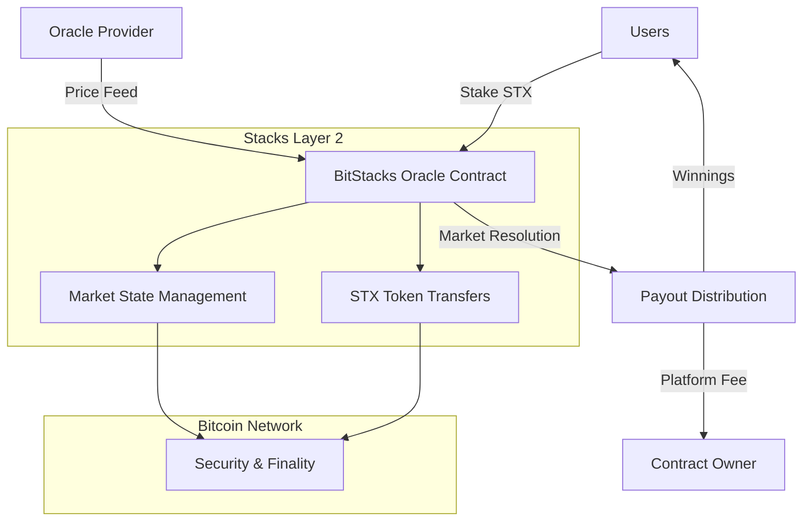
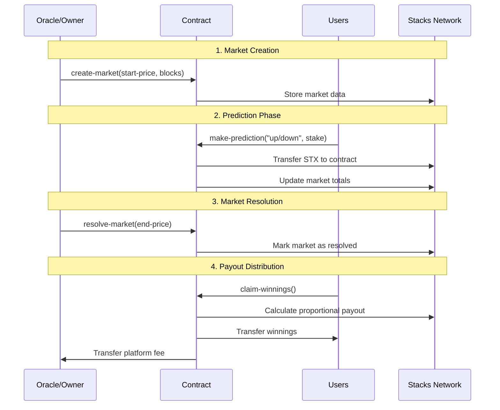

# BitStacks Oracle - Bitcoin Price Prediction Platform

[](https://www.stacks.co/)
[](https://bitcoin.org/)
[](https://clarity-lang.org/)

## Overview

BitStacks Oracle is a sophisticated decentralized prediction market platform built on Stacks Layer 2, enabling users to stake STX tokens on Bitcoin price movements. The platform leverages oracle-verified price feeds for transparent settlement and implements a fair proportional reward distribution system.

### Key Features

- 🎯 **Bitcoin Price Predictions** - Stake on BTC price direction (up/down)
- 🔗 **Oracle Integration** - Verified price settlement system
- 💰 **Proportional Rewards** - Fair distribution based on stake ratio
- 🛡️ **Stacks Security** - Secured by Bitcoin through Stacks consensus
- 📊 **Transparent Markets** - All operations on-chain and verifiable
- ⚡ **Low Fees** - Minimal 2% platform fee structure

## Architecture

### System Overview



### Contract Architecture

The BitStacks Oracle contract is structured into five main components:

#### 1. Core Data Structures

```clarity
;; Market Definition
{
  start-price: uint,     // Initial BTC price
  end-price: uint,       // Final BTC price (oracle-set)
  total-up-stake: uint,  // Total "up" predictions
  total-down-stake: uint,// Total "down" predictions
  start-block: uint,     // Market opening block
  end-block: uint,       // Market closing block
  resolved: bool         // Resolution status
}

;; User Predictions
{
  prediction: string,    // "up" or "down"
  stake: uint,          // STX amount staked
  claimed: bool         // Payout claim status
}
```

#### 2. Functional Modules

```
┌─────────────────────────────────────────────────────────────┐
│                    BITSTACKS ORACLE                         │
├─────────────────┬─────────────────┬─────────────────────────┤
│   Market Mgmt   │   Predictions   │     Administration      │
├─────────────────┼─────────────────┼─────────────────────────┤
│ • create-market │ • make-predict  │ • set-oracle-address    │
│ • resolve-market│ • claim-winnings│ • set-minimum-stake     │
│                 │                 │ • set-fee-percentage    │
│                 │                 │ • withdraw-fees         │
└─────────────────┴─────────────────┴─────────────────────────┘
```

## Data Flow

### Market Lifecycle



### Payout Calculation Logic

```
Total Pool = Up Stakes + Down Stakes
Winning Pool = Stakes on correct prediction
User Share = (User Stake / Winning Pool) × Total Pool
Platform Fee = User Share × 2%
Final Payout = User Share - Platform Fee
```

## Technical Specifications

### Smart Contract Details

- **Language**: Clarity (Stacks smart contract language)
- **Network**: Stacks Layer 2 (Bitcoin-secured)
- **Token**: STX (Stacks native token)
- **Minimum Stake**: 1 STX (1,000,000 micro-STX)
- **Platform Fee**: 2% of winnings
- **Oracle Model**: Single trusted oracle (upgradeable)

### Key Functions

#### Public Functions

- `create-market` - Initialize new prediction market
- `make-prediction` - Place stake on price direction
- `resolve-market` - Oracle price settlement
- `claim-winnings` - Retrieve proportional payouts

#### Read-Only Functions

- `get-market` - Retrieve market details
- `get-user-prediction` - View user's prediction data
- `get-contract-balance` - Check total STX held

#### Administrative Functions

- `set-oracle-address` - Update authorized oracle
- `set-minimum-stake` - Modify minimum bet amount
- `set-fee-percentage` - Adjust platform fee
- `withdraw-fees` - Extract accumulated fees

## Security Features

### Access Control

- **Owner-Only Functions**: Market creation, oracle updates, fee management
- **Oracle-Only Resolution**: Only authorized oracle can resolve markets
- **User Claim Protection**: Prevents double-claiming of winnings

### Validation Mechanisms

- **Timing Validation**: Markets enforce start/end block constraints
- **Balance Verification**: Users cannot stake more than they own
- **Parameter Validation**: All inputs validated for correctness
- **State Management**: Prevents invalid state transitions

### Economic Security

- **Proportional Payouts**: Fair distribution based on stake ratios
- **Fee Transparency**: Clear 2% platform fee structure
- **Oracle Trust**: Single point of failure mitigated by owner controls

## Usage Guide

### For Participants

1. **Find Active Market**: Check available prediction markets
2. **Make Prediction**: Choose "up" or "down" and stake amount
3. **Wait for Resolution**: Oracle provides final Bitcoin price
4. **Claim Winnings**: If correct, claim proportional payout

### For Market Operators

1. **Deploy Contract**: Deploy with desired parameters
2. **Set Oracle**: Configure trusted price feed provider
3. **Create Markets**: Launch prediction markets with timeframes
4. **Monitor Operations**: Track market activity and resolution
5. **Manage Fees**: Withdraw accumulated platform fees

## Development

### Prerequisites

- Stacks CLI
- Clarinet (Clarity development environment)
- Node.js (for testing scripts)

### Local Development

```bash
# Clone repository
git clone https://github.com/yene-robinson/bitstacks.git

# Install dependencies
npm install

# Run tests
clarinet test

# Deploy to testnet
clarinet deploy --testnet
```

### Testing

```bash
# Unit tests
clarinet test tests/bitstacks-oracle-test.ts

# Integration tests
npm run test:integration

# Coverage report
clarinet test --coverage
```

## Deployment

### Testnet Deployment

```bash
clarinet deploy --testnet --network testnet
```

### Mainnet Deployment

```bash
clarinet deploy --mainnet --network mainnet
```

## API Reference

### Market Creation

```clarity
(create-market 
  u65000000000  ;; $65,000 start price (micro-units)
  u1000         ;; Start at block 1000
  u2000         ;; End at block 2000
)
```

### Making Predictions

```clarity
(make-prediction 
  u0           ;; Market ID
  "up"         ;; Prediction direction
  u5000000     ;; 5 STX stake
)
```

### Claiming Winnings

```clarity
(claim-winnings u0) ;; Claim from market ID 0
```

## Roadmap

### Phase 1 (Current)

- ✅ Core prediction market functionality
- ✅ Oracle integration
- ✅ Basic fee structure

### Phase 2 (Planned)

- 🔄 Multi-oracle support
- 🔄 Advanced market types (price ranges)
- 🔄 Automated market makers

### Phase 3 (Future)

- 📋 Cross-chain price feeds
- 📋 Governance token integration
- 📋 Advanced analytics dashboard

## Contributing

We welcome contributions! Please see our [Contributing Guidelines](CONTRIBUTING.md) for details.

### Development Process

1. Fork the repository
2. Create feature branch
3. Write tests for new functionality
4. Submit pull request
